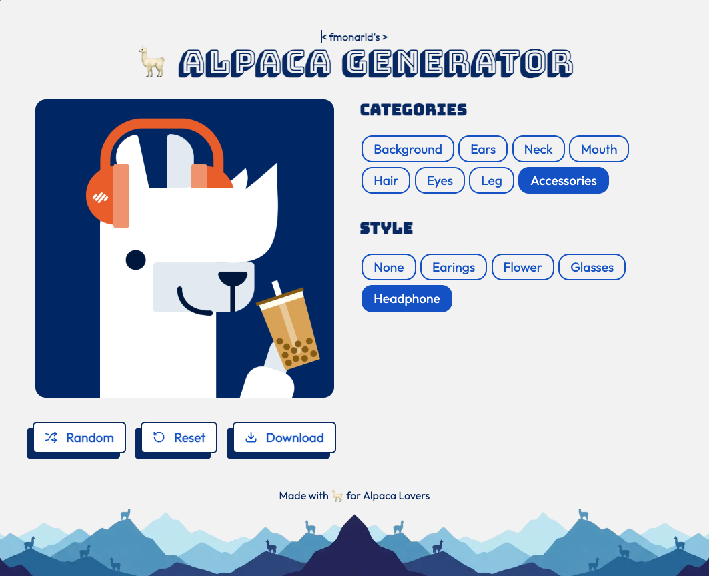
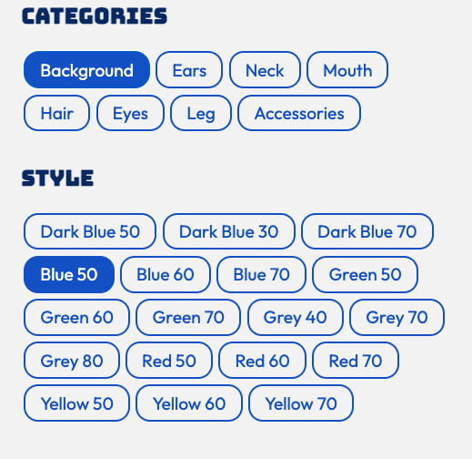

# 🦙 Alpaca Image Generator

A professional, interactive, and fun layered image generator built with **Astro** and **Vanilla JavaScript**. This project was inspired by the [CodeMentor](https://www.codementor.io/projects/web/alpaca-image-generator-website-ce2oc0eus8) challenge.

🚀 [Live Demo](https://alpaca-generator-alpha.vercel.app/)



## ✨ Features

- **50+ Customization Options**: Mix and match hair, ears, eyes, accessories, and more.
- **🎲 Smart Randomize**: Generate a unique alpaca design with a single click.
- **💾 Design Persistence**: Your latest creation is automatically saved in your browser (LocalStorage).
- **📥 High-Resolution Export**: Download your alpaca as a 1000px PNG file.
- **🎨 Nice UI/UX**: Responsive and tactile interface with smooth animations and custom modern illustratations.

---

## 📸 Demo & Screenshots

### 🧩 Layered Customization

_Select categories and change styles in real-time._


### 🎲 Random & Reset

_Explore thousands of combinations or return to defaults instantly._


### 💾 Download your Alpaca

_Get a high-quality PNG of your final design._


---

## 🛠️ Built With

- [Astro](https://astro.build/) - The web framework for content-driven websites.
- [Vanilla JavaScript](https://developer.mozilla.org/en-US/docs/Web/JavaScript) - For core application logic and performance.
- [Lucide Icons](https://lucide.dev/) - For clean, consistent iconography.
- [Google Fonts](https://fonts.google.com/) - Outfit & Bungee for a modern, playful look.
- [CSS Grid & Flexbox](https://developer.mozilla.org/en-US/docs/Web/CSS) - For a robust responsive layout.

---

## 🚀 Getting Started

To run this project locally:

1. **Clone the repository:**

   ```bash
   git clone https://github.com/YOUR_USERNAME/alpaca-img-generator.git
   ```

2. **Install dependencies:**

   ```bash
   npm install
   ```

3. **Start the development server:**

   ```bash
   npm run dev
   ```

4. **Build for production:**
   ```bash
   npm run build
   ```

---

## 📝 Author

_Created with 🦙 by [fmonarid](https://github.com/fmonarid/alpaca-generator) | A [Codementor Challenge](https://www.codementor.io/projects/web/alpaca-image-generator-website-ce2oc0eus8)._
